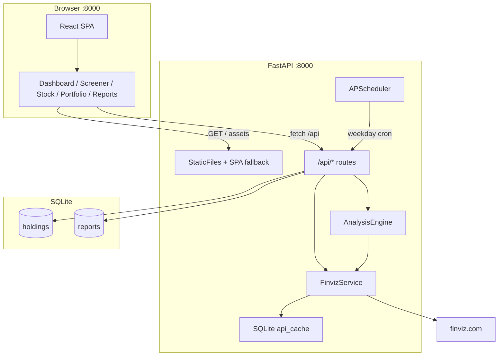
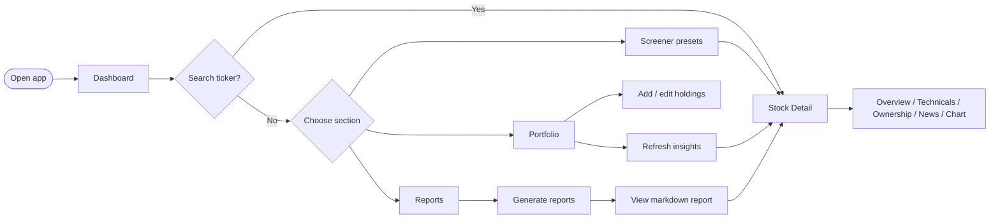
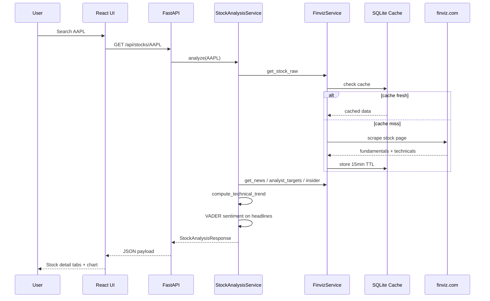
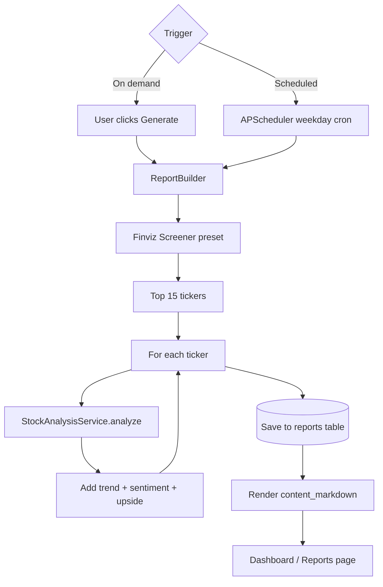
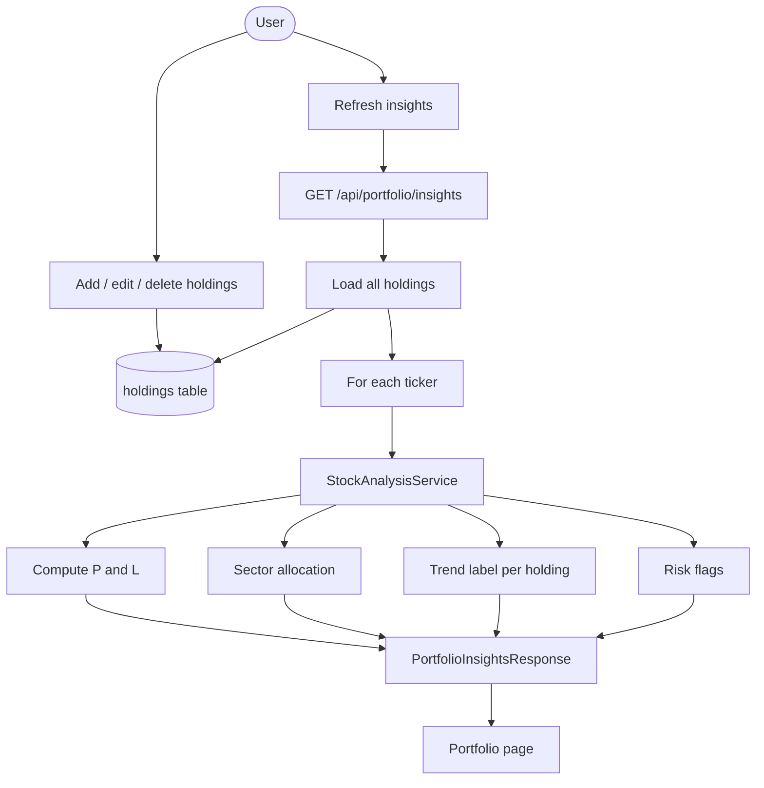
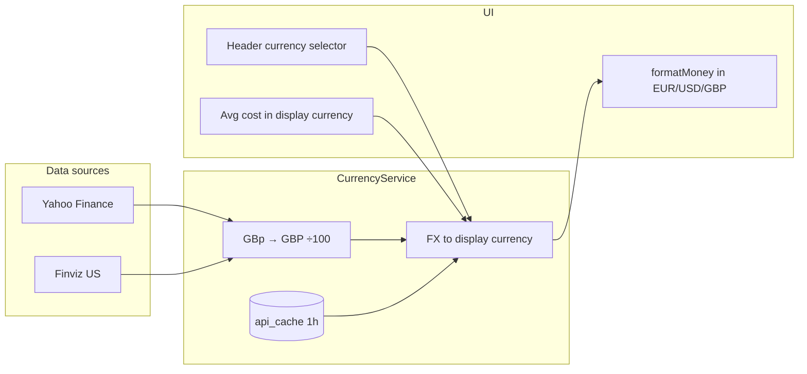
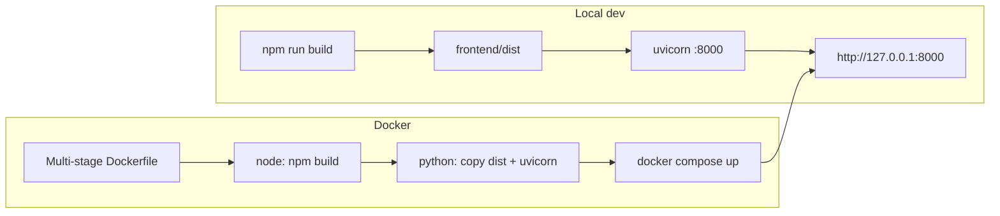

# Stock Analysis Report — Architecture

Flowcharts for the system overview, user journeys, and core data paths.

## System overview

## User journey

## Stock analysis request flow

## Report generation flow

## Portfolio insights flow

## Currency normalization

Yahoo returns minor-unit quotes for UK listings (`GBp`, `GBX`). Prices are converted to major units **before** RSI/SMA calculations in `yahoo_client.py`. All API responses include `native_price`, `native_currency`, `display_price`, and `display_currency`. The `price` and `currency` fields mirror display values for backward compatibility.

Portfolio `avg_cost` is stored as a float and interpreted in the user's selected display currency (EUR default).

## Deployment flow

## Key components

| Component | Location | Role |
|-----------|----------|------|
| React SPA | `frontend/src/` | User UI (search, screener, portfolio, reports) |
| FastAPI routes | `backend/app/api/` | REST endpoints |
| FinvizService | `backend/app/services/finviz_client.py` | Scrape Finviz + cache |
| StockAnalysisService | `backend/app/services/stock_analysis.py` | Per-ticker analysis |
| CurrencyService | `backend/app/services/currency_service.py` | Minor-unit fix + FX conversion |
| YahooFinanceClient | `backend/app/services/yahoo_client.py` | European listings + normalized prices |
| ReportBuilder | `backend/app/services/report_builder.py` | Screener-based reports |
| PortfolioService | `backend/app/services/portfolio.py` | Holdings aggregation |
| Static mount | `backend/app/static.py` | Serve `frontend/dist` on port 8000 |
| Scheduler | `backend/app/scheduler/jobs.py` | Weekday report + portfolio jobs |
